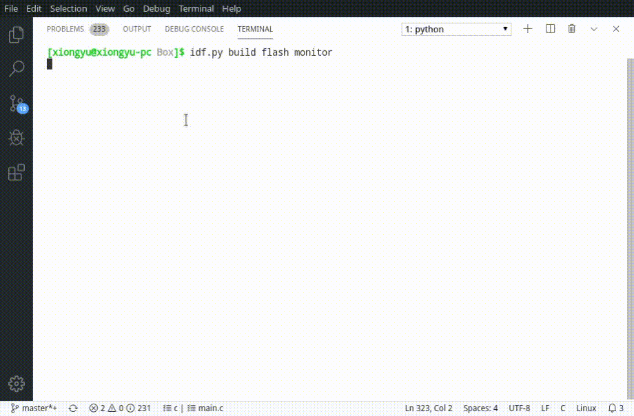

## _ESP_LUA_

Very pure Lua library, I only added the `esp_lua_port.h` header file to `luaconf.h`



## How to use

```bash
cd [project path]/components
git submodule add https://github.com/xiongyumail/esp_lua
```

* stdin, stdout, baselibs

When the output callback is set to NULL, output will be bound to `stdout` by default, full function `linenoise` will be used.

```c
#include "esp_lua.h"

void app_main()
{
    const char *ESP_LUA_ARGV[2] = {"./lua", NULL};
    esp_lua_init(NULL, NULL, NULL);
    while (1) {
        esp_lua_main(1, ESP_LUA_ARGV);
    }
}
```

* I/O redirection with callback, extension libs

Here callback is bound to STD I/O stream, just to show how to use it, you can also map it to other devices, such as LCD.

Complex terminal commands will be limited because they are not standard I/O. As a result, many linenoise features are not available.

```c
#include "esp_lua.h"

static int mylib_hello(lua_State *L) 
{
  lua_pushstring(L, "hello esp lua!");
  return 1;
}

static const luaL_Reg mylib[] = {
  {"hello",     mylib_hello},
  {NULL, NULL}
};

static int luaopen_mylib(lua_State *L) 
{
  luaL_newlib(L, mylib);
  return 1;
}

static const luaL_Reg mylibs[] = {
  {"mylib", luaopen_mylib},
  {NULL, NULL}
};

size_t esp_lua_input_callback(char *str, size_t len) 
{
    char c[128] = {0};
    size_t ret = 0;
    if ((ret = fread(c, sizeof(char), 128, stdin)) > 0) {
        memcpy(str, c, ret);
    }
    return ret;
}

size_t esp_lua_output_callback(char *str, size_t len) 
{
    size_t ret = 0;
    ret = fwrite(str, sizeof(char), len, stdout);
    return ret;
}


void lua_task(void *arg)
{
    char *ESP_LUA_ARGV[2] = {"./lua", NULL};

    esp_lua_init(esp_lua_input_callback, esp_lua_output_callback, mylibs);

    while (1) {
        esp_lua_main(1, ESP_LUA_ARGV);
    }

    vTaskDelete(NULL);
}

void app_main()
{
    xTaskCreate(lua_task, "lua_task", 8192, NULL, 5, NULL);
}
```
